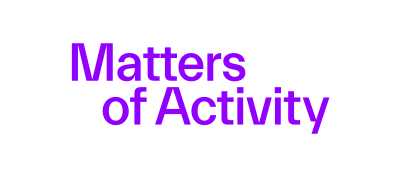

# 1st Research Software Day Berlin/Brandenburg June 3rd 2026

## Welcome

The Berlin University Alliance (BUA) and de-RSE e.V. Society for Research Software in Germany jointly organize the first Research Software Day in Berlin & Brandenburg.

The **goal** is to organize  
- **hands-on training** for local researchers, 
- **discussing overarching topics like training institutionalisation and governance** as well as 
- **giving a space and visibility to various initiatives** to present themselves and network for potential joint activities.

This is a prototype event.

## Target Audience
Aiming for 50--80 people
- researchers who write code
- professors, PIs of projects in which research software questions may arise
- computer scientists interested in research software
- RDM teams, data stewards and librarians who get questions about software management
- research managers & funding referents confronted with questions on research software
- transfer offices and initiatives in charge of informing about software patenting 

## Schedule (tbc)

### 9:00--12:00 Hands-on Sessions
- Legal Aspects of Research Software + Q & A (Dr. Till Kreutzer) *Room: ZL*
- Introduction to NHR@ZIB
- Code Review in Digital Humanities and CodeCheck for Publication Workflows
- tbd

### 12:00--14:45 Lunchbreak
- Catering
- Grußwort (Prof. Manfred Hauswirth -- Weizenbaum Institut)
- Keynote (Prof. Anna-Lena Lamprecht -- Universitaet Potsdam)
- Networking
- Visit the booths!
    - [FuturRSI](https://www.futursi.de/)
    - National High Performance Computing Center in Berlin [NHR@ZIB](https://nhr.zib.de/en/)
    - Research Software Award
    - Digital Humanities in Berlin
    - Wikimedia & Research Software Discovery 

### 14:45--15:45 Workshop Sessions I
- Research Software Engineering & Management at Helmholtz Association
- Data Science & NFDI
- RSE Training Initiatives
- Computational Reproducibility (Jochen Knaus)

### 15:45--16:00 Coffee Break
- get your caffeine fix

### 16:00--17:00 Workshop Sessions II
- AI services at Humboldt-Universitaet zu Berlin (Malte Dreyer CMS HU)
- AI governance BoF meeting (Carolin Odebrecht [IZD2M](izd2m.hu-berlin.de))
- tbd
- tbd

*more details coming soon*

## Location

*Cluster of Excellence Matters of Activity* Sophienstr. 22a, 10178 Berlin 
- [Open Street Map](https://osm.org/go/0MbFOilVf?node=1552074062) or [Google Maps](https://maps.app.goo.gl/gb1SuFBNcjNjTY6V6)
- in the 2nd backyard turn right and use the elevator or stairs to the 2nd floor and turn right into our central lab
- Nearby public transport: U8 Weinmeisterstraße, S Hackescher Markt, Tram M1 Weinmeisterstraße/Gipsstraße, train station Alexanderplatz
- parking spots for bicycles only (2nd backyard)

## Funding

The BUA and their programs *CORe* and *Open Science Ambassadors* aim to cover the costs for the RS Day and have staff assigned to the event organization. 

The event is greatly supported by the de-RSE association. 

We gladly acknowledge local support from the Cluster of Excellence Matters of Activity.
