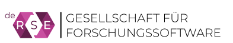
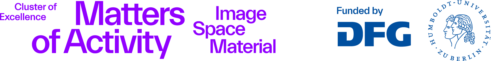

# First Research Software Day Berlin & Brandenburg, 3 June 2026

We are pleased to invite you to the **Research Software Day Berlin & Brandenburg**, which takes place in Berlin on **June 3, 2026**.

The event brings together researchers who (want to) develop software, networking and training initiatives for research software engineering, computer scientists interested in this domain, as well as RDM teams, data stewards, librarians and other research managers who are increasingly confronted with software questions. 

The aim of the Research Software Day is to **learn, share and strengthen local communities around research software** as a key component of open and responsible research. It is organized by the [Berlin University Alliance (BUA)](https://www.berlin-university-alliance.de/en/commitments/research-quality/core/index.html) and the [de-RSE e.V.](https://de-rse.org/en/) – Society for Research Software in Germany, in cooperation with the Cluster of Excellence [Matters of Activity](https://www.matters-of-activity.de/en/). In addition to the face-to-face event on June 3, online training events are organized during the whole week of [June 1-5, 2026 (the first ever *Research Software Week* in Germany!)](https://forschungssoftware.info/RSweeks/2026/).

**>> Please [register here](https://www.matters-of-activity.de/en/activities/18807/research-software-day-berlin-and-brandenburg) until Mai 19th for the Research Software Day 2026.**

## Schedule (see abstracts below)

| Time | Details|
|---|---|
|From 08:30| Arrival & Coffee |
|**09:00-12:00**| **Session 1: Hands-on Trainings** |
| |**(1.1) Rechtsfragen bei Forschungssoftware (in German language)**  *Till Kreutzer (iRights)*|
| |**(1.2) National High Performance Computing (NHR): An Introduction to the NHR@ZIB Site**  *Georgios Nikolis (ZIB), Steffen Christgau (ZIB)* |
| |**(1.3) How to create better code for better research? Where Small Steps Make Big Differences in Software Quality and Workflow Quality**  *Robert Casties (MPIWG), Julia Damerow (Arizona State), Daniel Nüst (TU Dresden), Malte Vogl (MPI Geoanthropology)*|
| |**(1.4) Tbc.**|
|12:00-12:45| Lunch Break|
|**12:45-13:00**| **Welcome**  *Prof. Manfred Hauswirth (BUA Advancing Research Quality and Value)*|
|**13:00-13:45**| **Keynote: “Better Software, Better Research”: How Research Software Engineering (RSE) Improves Scientific Practices**  *Prof. Anna-Lena Lamprecht (Universität Potsdam)* |
|**13:45-14:30**| **Networking and Coffee**  with booths by  - [FuturRSI](https://www.futursi.de/)  - Research Software Award der [Klaus Tschira Stiftung](https://klaus-tschira-stiftung.de/)  - [Open Research Office Berlin](https://www.open-research-berlin.de/)   - Wikimedia & Research Software Discovery|
|**14:30-15:30**| **Session 2: Workshops**
| |**(2.1) Unveiling the Iceberg: Enhancing the Quality and Visibility of Research Software at Helmholtz**  *Antonia Schrader (Helmholtz Open Science Office)*|
| |**(2.2) Connecting the Dots: Publications, Data, Models, and Code in the GenAI Era**  *Prof. Sonja Schimmler (TU Berlin, Fraunhofer FOKUS, Weizenbaum-Institut)*|
| |**(2.3) RSE Education: Into the Light**  *Julian Dehne (GI), Magnus Hagdorn (Charité), Nick Del Grosso (ibehave.nrw)*|
| |**(2.4) Reproducible Computational Analyses**  *Jochen Knaus (Weizenbaum-Institut)*|
|15:30-16:00| Coffee Break |
|**16:00-17:00**| **Session 3: Workshops**
| |**(3.1) From Experiment to Ecosystem: HU’s AI Service Infrastructure**  *Malte Dreyer (HU Berlin)*|
| |**(3.2) AI Research Governance. Responsiblity, regulation and guidelines in context of research developments**  *Carolin Odebrecht (HU Berlin)*|
| |**(3.3) 20 years of Open Source - lessons learned (tbc.)**  *Max Moorkamp (TU Berlin)*|
| |**(3.4) Tbc.**|
|17:00-17:15| Wrap-up and Closing |

**>> You can [register here](https://www.matters-of-activity.de/en/activities/18807/research-software-day-berlin-and-brandenburg) until Mai 19th.**

## Location

Cluster of Excellence *Matters of Activity* at Sophienstr. 22a, 10178 Berlin 
- wheelchair accessible
- [Open Street Map](https://osm.org/go/0MbFOilVf?node=1552074062) or [Google Maps](https://maps.app.goo.gl/gb1SuFBNcjNjTY6V6)
- in the 2nd backyard turn right and use the elevator or stairs to the 2nd floor and turn right into our central lab
- Nearby public transport: U8 Weinmeisterstraße, S Hackescher Markt, Tram M1 Weinmeisterstraße/Gipsstraße, train station Alexanderplatz
- parking spots for bicycles only (2nd backyard)

## Funding

The BUA and their [*Center for Open and Responsible Research (CORe)*](https://www.berlin-university-alliance.de/en/commitments/research-quality/core/index.html) and [*Open Science Ambassadors Program*](https://www.berlin-university-alliance.de/en/commitments/research-quality/openx/index.html) cover the costs for the RS Day and have staff assigned to the event organization. 

The event is greatly supported by the [de-RSE association](https://de-rse.org/en/). 

We gladly acknowledge local support from the [Cluster of Excellence *Matters of Activity*](https://www.matters-of-activity.de/en/).

## Contact
For questions, feedback, etc. please contact [Claudia Göbel](https://www.berlin-university-alliance.de/en/commitments/research-quality/personen/goebel-claudia/index.html) and/or [Alexander Struck](https://www.matters-of-activity.de/en/members/219/dr-alexander-struck).

## Abstracts
**Session 1: Hands-on Trainings (09:00-12:00)**
**(1.1) Rechtsfragen bei Forschungssoftware (in German language)**  *Till Kreutzer (iRights)*
Abstract is under discussion and will be published soon.

**(1.2) National High Performance Computing (NHR): An Introduction to the NHR@ZIB Site**  *Georgios Nikolis (ZIB), Steffen Christgau (ZIB)*
Abstract is under discussion and will be published soon.

**(1.3) How to create better code for better research? Where Small Steps Make Big Differences in Software Quality and Workflow Quality** *Robert Casties (MPIWG), Julia Damerow (Arizona State), Daniel Nüst (TU Dresden), Malte Vogl (MPI Geoanthropology)*
When in the research lifecycle do small interventions yield the largest gains in code, workflow, and research quality? This hands-on session explores that question by combining two complementary initiatives: CODECHECK (https://codecheck.org.uk/), which independently checks 
computational workflows as part of peer review, and the DHTech Code Review Working Group (https://dhcodereview.github.io/), which provides collaborative code review for in-progress research software. After introducing both initiatives, we examine diverse perspectives on what 
"good software/workflows" means in research contexts, discuss incentives and benefits, and identify practical, low-barrier quality improvements that individual researchers/developers as well as communities can adopt.

**Session 2: Workshops (14:30-15:30)**
**(2.1) Unveiling the Iceberg: Enhancing the Quality and Visibility of Research Software at Helmholtz**  *Antonia Schrader (Helmholtz Open Science Office)*
Open research software is central to transparent and reproducible science: only when both research data and program code are freely accessible can results be verified, reproduced, and reused. The Helmholtz Open Science Policy serves as the institutional framework to set shared standards and grant software the visibility and recognition it deserves within the Helmholtz Association. This presentation explores how initiatives like the Helmholtz Software Award, the Research Software Directory, and the Helmholtz Quality Indicators for Data and Software Products translate this policy into practice, ensuring the professionalization of research software as a research contribution and a visible pillar of scientific excellence.

**(2.2) Connecting the Dots: Publications, Data, Models, and Code in the GenAI Era**  *Prof. Sonja Schimmler (TU Berlin, Fraunhofer FOKUS, Weizenbaum-Institut)*
Generative AI is reshaping the research landscape, making transparency and reproducibility more critical than ever. As AI-augmented research cycles rise, this shift concerns all digital artifacts: publications, data, models, and code. This one-hour session explores the essential competencies and infrastructures required for this new era, featuring insights into the NFDI (National Research Data Infrastructure) and Data Competency Centers. Designed for both beginners and experts, the session opens with lightning talks on how GenAI reshapes science and redefines the necessary competencies and infrastructures. This transitions into a hands-on session, where participants engage in peer-to-peer discussions to navigate complex transparency and reproducibility challenges. The session culminates in a collaborative synthesis, drafting an outline for a joint paper to ensure a tangible community contribution.

**(2.3) RSE Education: Into the Light**  *Julian Dehne (GI), Magnus Hagdorn (Charité), Nick Del Grosso (ibehave.nrw)*
RSE Education has started out in some dark corners. PhD students may have had some practical tips from their supervisor. Colleagues meet online, and Stackoverflow has been relevant in building communities of interest. With the rise of the field, RSE education has stepped more and more into the light. First, mentoring and consulting was professionalized. Magnus Hagdorn talks about the Capentries and how they have shaped the RSE community as educators. Next, RSE education as a service was invented to move RSE workshops away from the central IT units toward a more method and research-centric support infrastructure. Nick del Grosse is going to talk about his experience leading such as service group and how he perceives RSE education from that angle. Finally, RSE education is stepping into the light fully by getting recognized and institutionalized as university classes. Julian Dehne talks about his experience coordinating the effort for guidelines for an RSE master as well as his two first RSE-classes taught in 2026 at RWTH.

**(2.4) Reproducible Computational Analyses**  *Jochen Knaus (Weizenbaum-Institut)*
Abstract is under discussion and will be published soon.

**Session 3: Workshops (15:45-16:45)**
**(3.1) From Experiment to Ecosystem: HU’s AI Service Infrastructure**  *Malte Dreyer (HU Berlin)*
This talk outlines the development of the AI infrastructure at Humboldt University of Berlin since 2023: from the first locally deployed language model to today’s comprehensive ecosystem comprising privacy-compliant LLMs and encoders, multimodal tools (transcription, image analysis, image generation, document summarisation) and integrations with other services. A key factor in its success is the operating model, which does not log personal data whilst ensuring API availability for in-house applications – complemented by the interactive ‘AI Teatime’ format, which feeds user requirements directly into development. The infrastructure is complemented by formats designed to promote AI literacy and platforms for Retrieval Augmented Generation (RAG) to create agent-based interaction formats in the fields of  research, teaching and administration.

**(3.2) AI Research Governance. Responsiblity, regulation and guidelines in context of research developments**  *Carolin Odebrecht (HU Berlin)*
Birds of a Feather (BoF) discussion session on AI governance targeting all levels of developers and engineers in academic research environments, addressing individual accountability, responsibility within teams and institutions, organizational governance frameworks, and necessary conditions for responsible AI development in scientific contexts. This informal forum aims to foster exchange also on ethical considerations and practical implementation challenges specific to software development and AI responsiblity in university settings. We will discuss existing governance approaches across organizational levels and actionable recommendations for responsible AI practices.

**(3.3) 20 years of Open Source – lessons learned (tbc.)**  *Max Moorkamp (TU Berlin)*
Abstract is under discussion and will be published soon.

