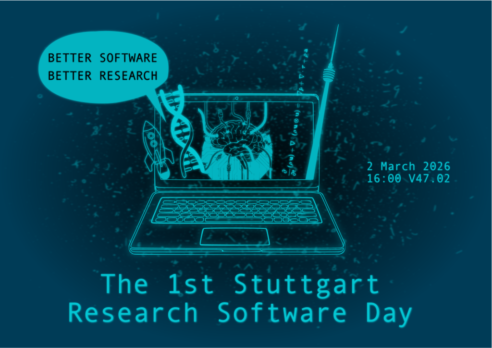
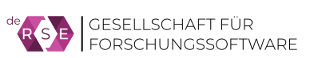

Am Montag, den **2. März 2026** fand auf dem Vaihinger Campus der Universität Stuttgart der **1. Stuttgarter Tag der Forschungssoftware** statt. Die Veranstaltung diente als nationales Forum für Studierende und Forschende, die Forschungssoftware in allen wissenschaftlichen Disziplinen entwickeln, warten und nutzen.

Viele Beiträge sind in dieser [Zenodo-Community](https://zenodo.org/communities/stuttgart-research-software-day-1/) verfügbar.

## Rückblick

Der erste Stuttgarter Tag der Forschungssoftware zog am 2. März 2026 **180 Teilnehmerinnen und Teilnehmer** an. Die Veranstaltung fand als Satellitenveranstaltung der deRSE26 statt, der 6. Konferenz für [Research Software Engineering (RSE) in Deutschland](https://events.hifis.net/event/2945/overview), die an der Universität Stuttgart unter dem Vorsitz von [Prof. Bernd Flemisch](https://www.iws.uni-stuttgart.de/institut/team/Flemisch-00002/) ausgerichtet wurde.

Nach einer Einführung durch Flemisch eröffnete [Simone Rehm](https://www.uni-stuttgart.de/universitaet/organisation/leitung/cio/), CIO der Universität Stuttgart, die Veranstaltung und betonte, dass Forschungssoftware professionelles Management und eine stabile Finanzierung benötige. Sie griff das Motto des [Software Sustainability Institute](https://www.software.ac.uk/) auf: „Better Software, Better Research.“ In einem Impulsvortrag ([Link](https://doi.org/10.5281/zenodo.18832029)) argumentierte [Jun.-Prof. Benjamin Uekermann](https://www.ipvs.uni-stuttgart.de/de/institut/team/Uekermann-00001/), dass Simulationssoftware über die [FAIR-Prinzipien](https://doi.org/10.1038/s41597-022-01710-x) hinausgehen und auch Benutzerfreundlichkeit und langfristige Wartbarkeit in den Vordergrund stellen müsse – Eigenschaften, die in traditionellen Publikationszyklen oft vernachlässigt würden.

Veranstalter [Jun.-Prof. Timo Koch](https://www.iws.uni-stuttgart.de/institut/team/Koch-00041/) bezeichnete die Teilnehmerzahl als Zeichen für die wachsende Bedeutung von RSE in der Wissenschaft. Eine vor der Veranstaltung durchgeführte [Teilnehmendenbefragung](https://doi.org/10.5281/zenodo.18828307) ergab, dass zwei Drittel der Anwesenden aus Stuttgart waren; ein Drittel stammte von anderen deutschen und internationalen Einrichtungen. Die RSE-Arbeit erstreckte sich nachweislich über alle Fakultäten. Die Projekte variieren stark in Größe und Entwicklungsstadium. Die Teilnehmenden waren sich über eine zentrale Lücke einig: den Mangel an festen Karrierewegen und zentraler institutioneller Unterstützung für RSEs. Mit ihren Plänen für ein institutionelles RSE-Center will die Universität Stuttgart diese Lücke in naher Zukunft schließen.

An diesem Tag wurden **60 Posterpräsentationen** gezeigt, die die ganze Bandbreite des Stuttgarter Software-Ökosystems veranschaulichten. Es wurde eine [Zenodo-Community](https://zenodo.org/communities/stuttgart-research-software-day-1/) eingerichtet, um die einzelnen Beiträge auffindbar und zitierfähig zu machen.

*Autor: Timo Koch; Lizenz: [CC0](https://creativecommons.org/public-domain/cc0/). Zuerst erschienen auf der [IWS-Webseite](https://www.iws.uni-stuttgart.de/institut/aktuelles/news/1.-Stuttgarter-Tag-der-Forschungssoftware-Rueckblick/).*

## Über die Veranstaltung

Forschungssoftware umfasst alle Softwarelösungen, die von Forschenden für wissenschaftliche Zwecke entwickelt und eingesetzt werden – von kleinen Skripten für Datenanalysen bis hin zu komplexen Simulations- und Hochleistungsrechenprogrammen. Sie bildet das **Rückgrat moderner Wissenschaft**, indem sie
- Experimente, Simulationen und Datenanalysen ermöglicht,
- Forschungsergebnisse reproduzierbar macht,
- Innovationen beschleunigt,
- und neue wissenschaftliche Fragestellungen überhaupt erst zugänglich macht.

Die Universität Stuttgart verfügt über eine [starke Expertise](https://www.uni-stuttgart.de/forschung/datenmanagement/forschungssoftware/) in der Entwicklung von Forschungssoftware – in Ingenieurwissenschaften, Mathematik, Informatik, Naturwissenschaften und weiteren Fachgebieten. Viele Arbeitsgruppen und wissenschaftliches Personal entwickeln international sichtbare Software, die in Forschung und Industrie erfolgreich eingesetzt wird. Dies macht Stuttgart zu einem idealen Ort, um die Bedeutung von Forschungssoftware sichtbar zu machen und den Austausch zwischen Entwickelnden, Anwendenden und Interessierten zu fördern.

## Programm

| Zeit | Details|
|---|---|
|**16:00-16:45**| **Begrüßung und Impulsvorträge** (Raum V47.02) |
| |**Eröffnung**  *Bernd Flemisch (IWS, Universität Stuttgart)*|
| |**Begrüßung**  *Simone Rehm (CIO, Universität Stuttgart)*|
| |**Impulsvortrag** ([Zenodo](https://doi.org/10.5281/zenodo.18832029))  *Benjamin Uekermann (IPVS, Universität Stuttgart)*|
| |**Teilnehmendenbefragung**  *Timo Koch (IWS, Universität Stuttgart)*|
|**16:45-18:30**| **Ausstellung mit Postern und Demos** (Foyer des V47)  60 Poster und Demos von Stuttgarter Arbeitsgruppen und Teilnehmenden der deRSE26|

Der Impulsvortrag beleuchtete, was Forschungssoftware ist, warum sie essenziell für die Wissenschaft ist und weshalb Stuttgart ein führender Standort in ihrer Entwicklung ist.
In der anschließenden Ausstellung präsentierten in Stuttgart ansässige Arbeitsgruppen und Einzelpersonen, die aktiv Forschungssoftware entwickeln, sowie weitere Teilnehmende der deRSE26-Konferenz ihre Software.

## Ort

Universität Stuttgart, Campus Vaihingen, Gebäude V47, Pfaffenwaldring 47, 70569 Stuttgart
- Vorträge in [Raum V47.02](https://maps.uni-stuttgart.de/ETI+I/16.6?q=V47.02), Ausstellung im Foyer des V47

## Rahmen

Die Veranstaltung wurde von der Universität Stuttgart als Satellitenveranstaltung der deRSE26-Konferenz des [de-RSE e.V.](https://de-rse.org/de/) ausgerichtet.

## Kontakt

Für Fragen, Feedback usw. wenden Sie sich bitte an [Timo Koch](https://www.iws.uni-stuttgart.de/institut/team/Koch-00041/) und/oder [Bernd Flemisch](https://www.iws.uni-stuttgart.de/institut/team/Flemisch-00002/).
