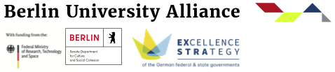

# Research Software Week 2026: June 1st--5th

## About

The idea is to gather events around research software in one place and promote them to a larger audience. This allows people interested in research software to see which workshops are available. As an event organizer the Research Software Week likely increases your reach and attendee count showcases interest in your topic.

## Register your software event

Please submit your event to this [Google Spreadsheet](https://docs.google.com/spreadsheets/d/1FK3JPWAdnKYjdPtG-pgb0d3Cp1XldOZG1XZ2UoK0BWQ/edit?usp=sharing)

We encourage you to recycle existing talks and workshop concepts.

## Programm

*coming soon, generated from your submissions*

## Acknowledgments

2026 is the first instance of the Research Software Week. This is inspired by the international Love Data Week and [Open Access Week](https://www.openaccessweek.org/).

The organization of the Research Software Week is supported by the [Berlin University Alliance (BUA) Center for Open and Responsible Research (CORe)](https://www.berlin-university-alliance.de/en/commitments/research-quality/core/index.html).

This event is co-organized by the Cluster of Excellence Matters of Activity.

This Research Software Week is also supported by [de-RSE e.V. - Society for Research Software in Germany](https://de-rse.org/en/).

## Contact

Please send feedback, questions, etc. to [Claudia Göbel](mailto:claudia.goebel@berlin-university-alliance.de) and/or [Alexander Struck](mailto:alexander.struck@hu-berlin.de). 

## Future Work

The Research Software Week will be coordinated with international RSE initiatives in the years to come.

](https://pad.gwdg.de/QeswZrlUTJOk-xcm1akAjA?both#)
